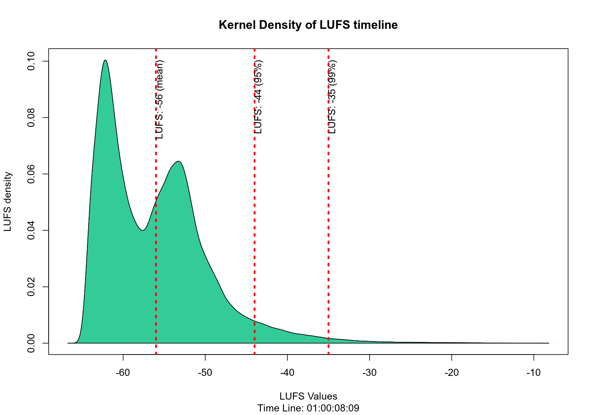

Package for loudness analysis. It performs a series of analyses from an
audio file by first transforming it into a timeline with the loudness
values. This package depends on the [ffmpeg](https://ffmpeg.org/) tool
that should be previously installed.

First, we can load an audio file, to generate a `lutl` object, which is
nothing more than, a series of loudness level observations per time.

``` r
library(loudness)

tl <- lutl_from_file('audio/R_MIC_200903-165318.mp3')
#> Get loudness from audio/R_MIC_200903-165318.mp3 using ffmpeg... 
#> Parsinng data... 
#> Process datetime... 
#> Elapsed time: 4.51
```

From the timeline, we can study the distribution of loudness levels:

``` r
loudness::plot_density(tl)
```


