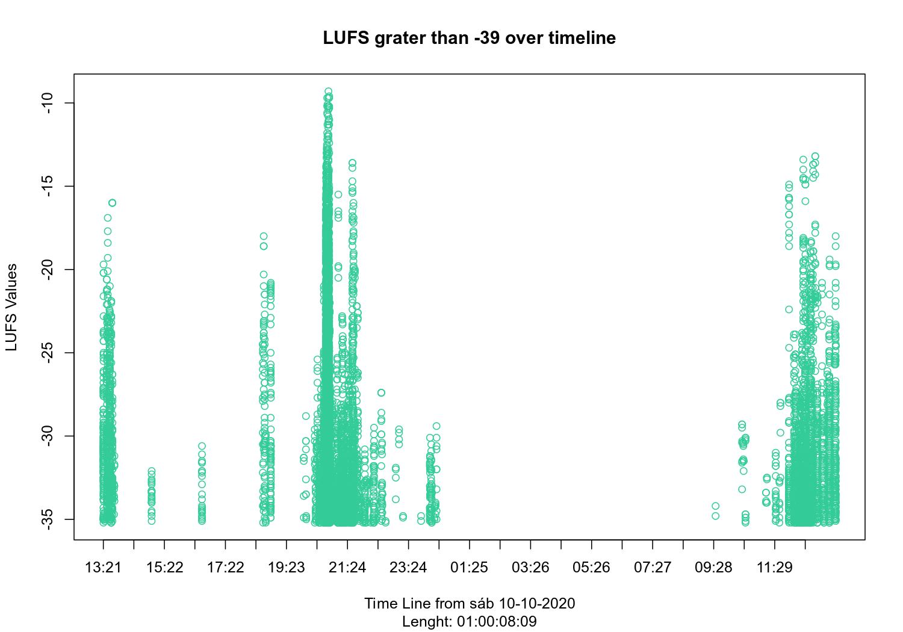

Package for loudness analysis. It performs a series of analyses from an
audio file by first transforming it into a timeline with the loudness
values. This package depends on the [ffmpeg](https://ffmpeg.org/) tool
that should be previously installed.

The length of the timeline will be from a tenth of a second to multiple
hours, or days. The limit will be on the length of audio file that
`ffmpeg` is able to process, the disk space, for the extraction of the
LUFS values, the memory capacity to handle the amount of observations
involved. As an example, about 24 hours of recording, are transformed
into a lutl of 868899 observations and about 23 MB, processed in about
15 minutes

First, we can load an audio file, to generate a `lutl` object, which is
nothing more than, a series of loudness level observations per time.

``` r
library(loudness)

tl <- lutl_from_file('audio/R_MIC_200903-165318.mp3')
#> Get loudness from audio/R_MIC_200903-165318.mp3 using ffmpeg... 
#> Parsinng data... 
#> Process datetime... 
#> Elapsed time: 5.01 
#> Lenght of tl: 00:00:09:54
```

The `lutl` objects like any other object in R can be saved and it is
recommended to do so:

``` r
saveRDS(tl, 'audio/R_MIC_201010-132132.Rds')
tl <- readRDS('audio/R_MIC_201010-132132.Rds')
```

From the timeline, we can study the distribution of loudness levels:

``` r
plot_density(tl)
```


You can also reproduce some part of the timeline

``` r
play(tl)
```

We can also study loud sounds within a timeline

``` r

tl <- readRDS('audio/R_MIC_201010-132132.Rds')

plot_timeline(tl, 99)
```


